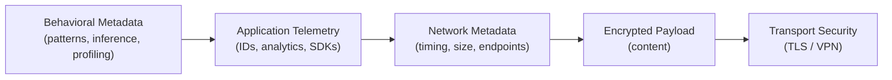
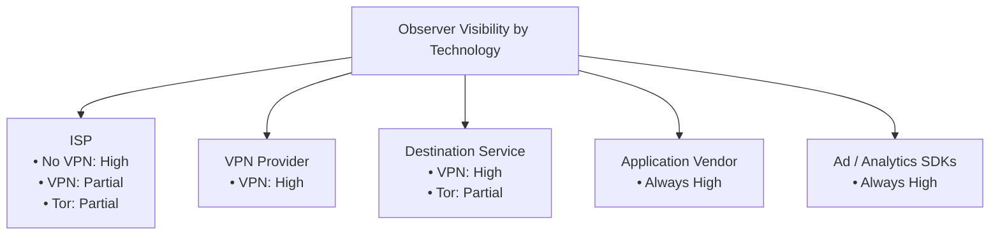
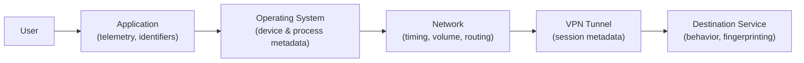
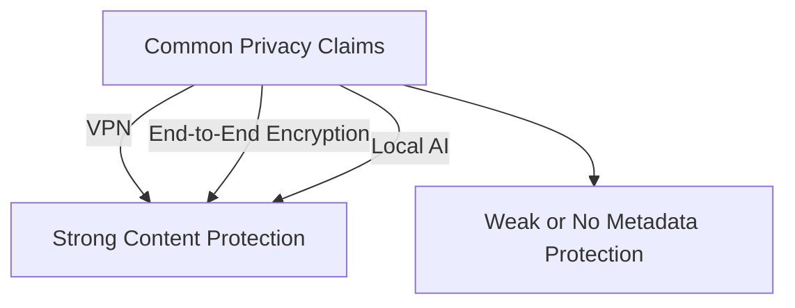
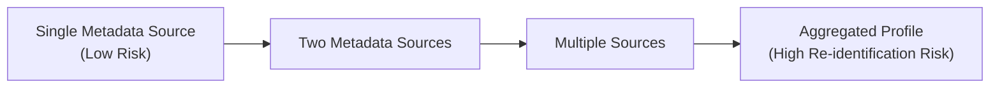
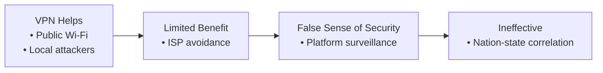

Metadata harvesting is the process of automatically collecting descriptive data about other data ... for example, timestamps, geolocation tags, device identifiers, access logs, and relationships between data assets without necessarily extracting the underlying content itself. The practice underpins many modern data systems, from scholarly search engines and enterprise data catalogs to large-scale surveillance and profiling systems.
<!-- more -->

## What Is Metadata and Metadata Harvesting?

**Metadata** is “data about data”, structured information that describes attributes of a resource, such as title, author, creation time, format, relationships, location, and usage metrics. In information science, metadata enables search, classification, discovery, interoperability, and analytics.

**Metadata harvesting** refers to automated aggregation of metadata records from distributed sources into a centralized index or service. Protocols such as the **Open Archives Initiative Protocol for Metadata Harvesting (OAI-PMH)** formalize metadata harvesting in academic and archival contexts, enabling diverse digital libraries and repositories to expose metadata in standardized schemas like Dublin Core.

In enterprise environments, metadata harvesting powers **data catalogs** and **data lineage** efforts by discovering schema, schema relationships, lineage, tags, and usage patterns across an organization’s data assets.

### Benefits of Metadata Harvesting

- **Improved Discoverability and Searchability**: Harvested metadata allows federated search over distributed collections without needing direct access to content. For example, academic repositories expose metadata via OAI-PMH so aggregator services (like CORE or institutional search portals) can index and unify records from many sources, improving research discoverability.
- **Interoperability and Standardization**: Metadata harvesting drives interoperability in heterogeneous environments. By normalizing metadata with agreed schemas and protocols, systems built by different vendors can share descriptive information efficiently. This is especially important for digital libraries, cross-institution portals, and global research infrastructure.
- **Resource Efficiency and Analytics**: Rather than moving full data objects, metadata harvesting enables efficient queries and analytics at scale. It supports predictive maintenance, inventory management, and automated catalog updates without deep content inspection.

### Risks and Concerns in Metadata Harvesting

- **Privacy and Re-identification Risk**: Even without harvesting full content, metadata often carries sensitive information. For example, geolocation metadata embedded in photos or communications metadata reveal movement patterns, social graphs, and behavioral patterns. Researchers have shown that metadata can be sufficient to re-identify individuals or infer sensitive information, even when the underlying content is encrypted.
- **Mosaic Effect and Cross-Dataset Inference**: Metadata aggregated across sources enables the mosaic effect—the cumulative combination of multiple data attributes to uniquely identify individuals. This effect means that ostensibly non-identifying fields (ZIP code, timestamps, device IDs) can be linked to reveal sensitive profiles when combined with auxiliary data.
- **Regulatory and Ethical Risks**: Legal frameworks such as GDPR treat certain metadata as personal data if it identifies or relates to an identifiable person. Mass harvesting without adequate privacy controls risks non-compliance with data protection laws and can trigger regulatory penalties and litigation.
- **Quality, Bias, and Inconsistency**: Metadata quality varies widely across sources. Inconsistent tagging, schema errors, missing fields, and malformed identifiers can reduce the utility of harvested metadata and mislead downstream analytics or governance processes.

### Metadata Harvesting in Practice

- **Open Research Discovery Platforms**: Platforms like PubMed, arXiv, and institutional repositories expose metadata that is harvested via OAI-PMH or APIs into aggregated search services, improving access to scholarly records across silos.
- **News Aggregation and SEO Systems**: News aggregators harvest headlines and metadata (e.g., publication time and topic tags) from RSS feeds and schema.org markup on publisher websites to power real-time content feeds and personalization.
- **Operational Technology Analytics**: Enterprise platforms harvest metadata from sensors, logs, and file systems to enable proactive operations monitoring, trend analytics, and automation.
- **Consumer Surveillance and Profiling**: Large platforms collect behavioral metadata (click streams, session durations, device identifiers) at scale. These metadata feeds power recommendation engines, ad auctions, profiling systems, and cross-service linkage that far exceed the simple functionality users expect.

## Why “No Logs” or “Local AI Only” Claims Don’t Prevent Metadata Harvesting

### Ecosystem Metadata Outside Core Logs

Promises like “we don’t log” or “AI runs entirely locally” can be misleading because:

- **System Operation Requires Metadata**: Even truly “no-log” systems must generate some operational metadata (e.g., request sizes, timing, authentication metadata) to function securely and troubleshoot incidents. Complete absence of logs is often implausible or unsafe.
- **Client-Side Metadata Leaks**: Local AI or device-resident services still produce external signals such as network traffic volume, timing, or interaction patterns. These signals can be harvested by network observers or service providers unless fully air-gapped and hardware-verified.
- **Third-Party Platforms and Dependencies**: Many services integrating local AI still interact with cloud APIs, content delivery networks, advertisement networks, or telemetry services. Even if content isn’t logged, metadata flows (e.g., timing, device identifiers) can be captured by adjacent systems.
- **Cross-Service Aggregation**: Metadata like session identifiers, ad IDs, device fingerprints, and web browser telemetry is routinely shared across services via SDKs, analytics tools, and trackers—effectively harvesting metadata independently of content policy.

### Metadata in Encryption Contexts

Encryption may protect content but not metadata. Cryptography research has shown that encrypted files and communications often leak metadata through headers, length, and structural markers unless special formats (like PURBs) are used to hide all such information.

This means that claims of “end-to-end encryption” do not negate metadata collection unless protocols also obfuscate metadata patterns.

## Mitigations and Best Practices

### Technical Controls

- **Metadata Minimization**: Design systems to collect only what is strictly necessary and anonymize or pseudonymize metadata fields where feasible.
- **Metadata Encryption and Padding**: Use advanced formats like PURB to hide metadata leakage in encrypted payloads.
- **Differential Privacy for Traffic Patterns**: Systems like Stadium and other research prototypes apply noise and mixing to reduce inference from metadata (e.g., communication patterns).
- **Metadata Governance**: Implement cataloging, validation, quality control, and retention policies that align with compliance frameworks and reduce unnecessary exposure.

### Organizational Controls

- **Privacy Impact Assessments**: Evaluate metadata harvesting programs for legal, ethical, and reputational risk.
- **Regulatory Compliance**: Classify metadata attributes under applicable data protection laws and treat personal metadata with appropriate safeguards.
- **Transparency and User Trust**: Clearly communicate what metadata is collected, how it is used, and how long it is retained.

## Why VPNs Often Create a False Sense of Security: Raw Data vs. Metadata

Virtual Private Networks (VPNs) are frequently marketed as comprehensive privacy solutions. In practice, they primarily protect content in transit, not the metadata that governs, surrounds, and contextualizes that content. This distinction is critical to understanding both the real benefits of VPNs and their substantial limitations.

### What a VPN Actually Protects

A VPN establishes an encrypted tunnel between a client device and a VPN endpoint. This provides several legitimate security benefits:

- Confidentiality of payload data against local network observers _(e.g., public Wi-Fi attackers)_.
- IP address substitution, obscuring the user’s origin IP from destination services.
- Integrity protection against packet manipulation in transit.

These protections apply almost exclusively to raw data _(the contents of packets)_, not to all metadata generated by the session.

### Metadata That VPNs Do Not Eliminate

Even when a VPN is functioning as intended, significant metadata remains exposed or newly centralized:

- Connection metadata: session start/stop times, duration, bandwidth usage, packet counts.
- Traffic shape and timing: burst patterns, request intervals, and flow direction, which enable traffic fingerprinting and correlation attacks.
- Endpoint metadata: the VPN provider sees both the user’s real IP address and the destination IPs.
- Application-layer metadata: DNS requests (if not properly tunneled), SNI fields, certificate metadata, and protocol identifiers.

Numerous academic studies demonstrate that encrypted traffic can still be classified, profiled, and deanonymized using metadata alone. In other words, what you do can often be inferred without seeing what you said.

### VPNs Shift Trust — They Do Not Remove It

A VPN does not eliminate surveillance or data collection; it reassigns trust:

- Without a VPN, metadata is visible to the ISP and local network operators.
- With a VPN, that same metadata is concentrated at the VPN provider.

This creates a single, high-value aggregation point for metadata harvesting. Even providers that advertise “no logs” typically must retain operational metadata for abuse prevention, capacity planning, DDoS mitigation, and legal compliance. As a result:

- “No content logs” ≠ “no metadata”
- “No logs” ≠ “no correlation possible”

From a risk perspective, VPNs often centralize metadata rather than reduce it.

### VPNs vs. Modern Tracking and Fingerprinting

VPNs are largely ineffective against:

- Browser fingerprinting (fonts, canvas, WebGL, hardware features)
- Account-based tracking (logged-in services, identity federation)
- Cross-device correlation (shared credentials, behavioral similarity)
- Telemetry embedded in applications and SDKs

In these cases, metadata harvesting occurs above the network layer. The VPN tunnel becomes irrelevant once identifiers and behavioral metadata are voluntarily emitted by the application or browser itself.

### When VPNs Do Improve Privacy

Despite their limitations, VPNs can still play a meaningful role when used correctly and with realistic expectations:

- Protection against local adversaries, such as hostile Wi-Fi environments or ISP-level inspection.
- Jurisdictional risk reduction, when carefully selecting providers under favorable legal regimes.
- IP-based unlinkability, reducing basic location inference and coarse-grained tracking.

However, these benefits are incremental, not absolute.

### Why VPN Marketing and Reality Diverge

VPN marketing often conflates three distinct concepts:

- Encryption
- Anonymity
- Privacy

VPNs reliably provide the first, inconsistently contribute to the second, and only partially support the third. Metadata harvesting exploits this gap. Even perfectly encrypted tunnels still emit rich, analyzable metadata that can be harvested, aggregated, and correlated across systems.

### Risk-Based Takeaway

From a security and risk analysis perspective:

- VPNs reduce certain exposure vectors
- VPNs do not meaningfully prevent metadata harvesting
- VPNs may increase centralized metadata risk
- VPNs should be treated as a tactical control, not a strategic privacy solution

Effective privacy protection requires layered defenses: metadata minimization, application hardening, traffic analysis resistance, identity separation, and strong governance—not reliance on a single network abstraction.

## Raw Data vs. Metadata Protection by Technology

| Technology | Protects Raw Content | Hides Source IP | Hides Destination | Limits Traffic Analysis | Reduces Metadata Harvesting |
|------------|----------------------|-----------------|-------------------|-------------------------|-----------------------------|
| VPN | Yes (in transit) | Partial | No | Minimal | Low |
| Tor (Onion Routing) | Yes | Yes | Yes | Moderate | Moderate–High |
| Mix Networks | Yes | Yes | Yes | High | High |
| Local-Only AI (Offline) | Yes | N/A | N/A | N/A | High (if truly isolated) |
| Encrypted App w/ Telemetry | Yes | No | No | Low | Low |
| End-to-End Encryption (E2EE) | Yes | Partial | No | Low | Low |
| Air-gapped System | Yes | Yes | Yes | Very High | Very High |

!!! tip "Key Insight"
    Most consumer tools focus on content confidentiality. Metadata protection requires **traffic shaping**, **delay**, **mixing**, or **isolation**, which VPNs do not provide.

## Metadata Visibility by Observer

| Observer | No VPN | VPN | Tor | Local-Only / Offline |
|----------|--------|-----|-----|----------------------|
| ISP | Full metadata visibility | Sees VPN usage + timing | Sees Tor usage + timing | None |
| VPN Provider | N/A | Full session metadata | N/A | None |
| Destination Service | Full IP + behavior metadata | Sees VPN IP + behavior | Sees Tor exit node | None |
| Application Vendor | Full telemetry | Full telemetry | Full telemetry | Limited or none |
| Ad/Analytics SDKs | Full identifiers | Full identifiers | Full identifiers | None |

!!! tip "Key Insight"
    VPNs **move metadata exposure**, they do not eliminate it. Application-level metadata is unaffected.

## Privacy Claims vs. Reality

| Claim | What It Usually Means | What Still Leaks |
|--|--|--|
| “We don’t log” | No content stored | Timing, volume, abuse logs, auth metadata |
| “AI runs locally” | Model inference is local | App telemetry, OS events, network signals |
| “End-to-end encrypted” | Payload encrypted | Social graph, message timing, frequency |
| “Anonymous browsing” | IP masked | Fingerprints, behavior, accounts |
| “VPN = privacy” | Encrypted tunnel | Centralized metadata, traffic patterns |

!!! tip "Key Insight"
    Most privacy claims **omit metadata scope**, either intentionally or due to poor threat modeling.

## VPNs — Benefits vs. Risks

| Dimension | Benefit | Risk |
|--|--|--|
| Network Security | Protects against local sniffing | Creates single metadata aggregation point |
| Privacy | Hides IP from destinations | VPN sees everything |
| Compliance | Helps with insecure networks | Provider jurisdiction risk |
| Surveillance Resistance | Stops casual inspection | Vulnerable to correlation attacks |
| User Trust Model | Simple | Misplaced confidence |

!!! tip "Key Insight"
     VPNs are **defensive controls**, not privacy architectures.

## Threat Model Alignment

| Threat Actor | VPN Effective | Tor Effective | Mix Network Effective | Local-Only Effective |
|--|--|--|--|--|
| Café Wi-Fi attacker | Yes | Yes | Yes | Yes |
| ISP profiling | Partial | Yes | Yes | Yes |
| Platform surveillance | No | No | No | Partial |
| Nation-state correlation | No | Partial | Yes | Yes |
| Advertising ecosystem | No | No | No | Yes |

!!! tip "Key Insight"
    Most real-world privacy loss occurs above the network layer, where VPNs offer no protection.

## Charts

### Data Exposure Stack: Raw Data vs Metadata

Show why encryption/VPNs protect payloads but not metadata.

!!! tip "Interpretation"
    Privacy risk increases up the stack, while most tools only protect the bottom layers.

### Observer Visibility Matrix (Heatmap-Style Table)

Show who can see metadata under different technologies.

!!! tip "Interpretation"
    VPNs shift metadata visibility; they do not eliminate it.

### Metadata Leakage Despite Encryption (End-to-End Flow)

Show where metadata is generated and harvested.

!!! tip "Interpretation"
    Even with encryption, metadata is emitted at every layer.

### Privacy Claims vs Reality (Conceptual Comparison)

Contrast marketing claims with actual protection.

!!! tip "Interpretation"
    Most claims emphasize content confidentiality, not metadata risk.

### Metadata Aggregation Risk (Mosaic Effect)

Illustrate non-linear re-identification risk.

!!! tip "Interpretation"
    Risk compounds as metadata sources are combined.

### When VPNs Help vs Hurt (Decision Quadrant)

Encourage risk-based thinking.

!!! tip "Interpretation"
    VPNs are effective only in narrow threat models.

## Conclusion

Metadata harvesting is a powerful enabler in information discovery, analytics, and operational efficiency—supporting everything from scholarly repositories to enterprise data governance. However, the same processes enable privacy exposure, profiling, inference attacks, and regulatory risk when uncontrolled.

Claims of “no logging” or “local AI” are insufficient defenses against metadata harvesting because they often overlook ancillary channels and ecosystem interactions where metadata is generated, aggregated, and shared. Robust security requires not just content encryption or narrow promises, but comprehensive metadata governance and privacy engineering.

- VPNs protect data, not behavior
- Metadata is the primary privacy risk vector
- Most “privacy” tools fail due to metadata leakage
- True privacy requires layered controls, not a single product

## Resources

- **Open Archives Initiative Protocol for Metadata Harvesting (OAI-PMH)**: A technical standard used by digital libraries and repositories to expose structured metadata that can be harvested by aggregators and indexing services.
    - URL: https://en.wikipedia.org/wiki/Open_Archives_Initiative_Protocol_for_Metadata_Harvesting
- **CORE: A Global Aggregation Service for Open Access Papers**: Research paper on large-scale metadata harvesting across institutional repositories, illustrating how metadata can be systematically collected and analyzed at scale.
    - URL: https://www.nature.com/articles/s41597-023-02208-w
- **“You Are Your Metadata: Identification and Obfuscation of Social Media Users Using Metadata Information”**: Peer-reviewed research using Twitter metadata to show that metadata alone can identify users with high accuracy (~96.7%), underscoring that metadata is not non-sensitive.
    - URL: https://arxiv.org/abs/1803.10133
- **“Please Forget Where I Was Last Summer: The Privacy Risks of Public Location (Meta)Data”**: Demonstrates how location metadata (e.g., GPS) can be used to de-anonymize users and infer sensitive personal information.
    - URL: https://arxiv.org/abs/1901.00897
- **Rethinking Privacy in Machine Learning Pipelines from an Information Flow Control Perspective**: Highlights that many ML privacy frameworks ignore metadata, which can still enable inference attacks.
  -   URL: https://arxiv.org/abs/2311.15792
- **Trajectory Recovery From Ash: User Privacy Is NOT Preserved in Aggregated Mobility Data**: Shows how even aggregated metadata can be used to recover individual movement patterns and real-world sensitive information.
    - URL: https://arxiv.org/abs/1702.06270
- **USENIX Security: How and Why People Use Virtual Private Networks**: Empirical study on VPN use and risk; discusses real metadata leak risks (IPv6, DNS leaks, trackers) and misperceptions about VPN privacy guarantees.
    - URL: https://www.usenix.org/system/files/sec22-dutkowska-zuk.pdf
- **“What and Who VPN Providers Claim to Shield Consumers …” (ACM Library)**: Recent (2025) academic article analyzing privacy and security claims by consumer VPN providers, important for critiquing “no logs” and privacy promises.
    - URL: https://dl.acm.org/doi/full/10.1145/3706598.3713980
- **Leaking VPN Client Traffic by Abusing Routing Tables**: Technical research demonstrating how VPN clients can inadvertently leak clear traffic despite encryption—relevant for metadata exposure.
    - URL: https://www.usenix.org/system/files/usenixsecurity23-xue.pdf
- **Michigan Engineering News: Are VPNs Really the Answer?**: Coverage of academic research confirming that VPNs alone often do not provide comprehensive privacy protection.
    - URL: https://news.engin.umich.edu/2023/02/are-vpns-really-the-answer/
- **Mosaic Effect (Wikipedia)**: Standard reference explaining how combining multiple seemingly innocuous pieces of data—including metadata—can result in sensitive inferences.
    - URL: https://en.wikipedia.org/wiki/Mosaic_effect
- **Privacy Risks in Metaverse and Telemetry Metadata**: eXtended Reality Safety Initiative talk on telemetry/behavioral metadata in VR/AR environments.
    - URL: https://rdi.berkeley.edu/metaverse/metadata/
- **Metadata Standards for Image/Media Files (ExifTool)**: useful for real-world file metadata examples.
    - URL: https://en.wikipedia.org/wiki/ExifTool
- **Metadata harvesting protocols**: “The Open Archives Initiative Protocol for Metadata Harvesting (OAI-PMH) is a widely adopted standard for exposing structured metadata across repositories” (see OAI-PMH).
- **Privacy re-identification risks**: “Academic research shows that metadata alone can uniquely identify users with high accuracy” (Perez et al., 2018).
- **VPN metadata leakage**: “Empirical analysis confirms that popular VPNs can leak traffic and metadata, and users often misunderstand their privacy properties.”
- **Mosaic effect**: “The mosaic effect demonstrates how metadata from disparate sources can be recombined to reveal sensitive information.”
